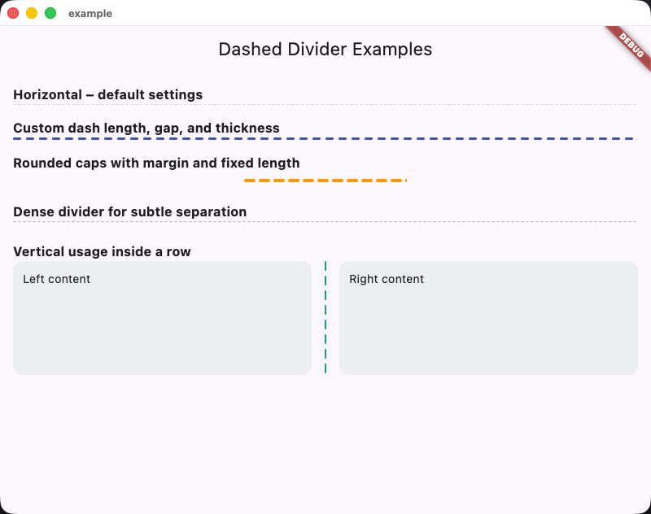

# Dashed Divider 虚线分割线

A lightweight Flutter widget for drawing horizontal or vertical dashed dividers with customizable dash length, gap, thickness, color, margin, rounded caps, and optional fixed length.

轻量级 Flutter 虚线组件，支持横向/纵向分割，任意控制虚线长度、间隔、粗细、颜色、外边距、圆角以及固定长度。

## Features | 功能亮点
- Horizontal or vertical orientation | 支持横向/纵向两种方向
- Configurable dash length, gap, thickness, color | 任意调整虚线长度、间隔、粗细与颜色
- Optional margin, rounded caps, and fixed total length | 可设置外边距、圆角和固定长度
- Works as a drop-in replacement for Divider | 可以直接替换原生 Divider 使用

## Installation | 安装
Add the dependency in `pubspec.yaml`:

```yaml
dependencies:
  dashed_divider: ^1.0.0
```

## Usage | 示例
See `example/lib/main.dart` for a full demo. Basic usage:

```dart
import 'package:dashed_divider/dashed_divider.dart';

// Horizontal divider with default settings.
const DashedDivider();

// Custom colors and dash parameters.
const DashedDivider(
  dashLength: 10,
  dashGap: 6,
  thickness: 3,
  color: Colors.indigo,
);

// Vertical divider inside a Row.
const DashedDivider(
  axis: Axis.vertical,
  dashLength: 12,
  dashGap: 6,
  thickness: 2,
  color: Colors.teal,
);
```

完整示例请查看 `example/lib/main.dart`，其中展示了多种配置与布局场景。

## Screenshot | 预览截图

